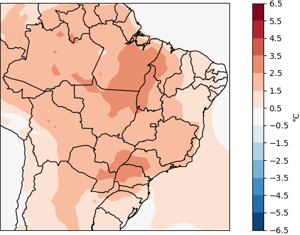
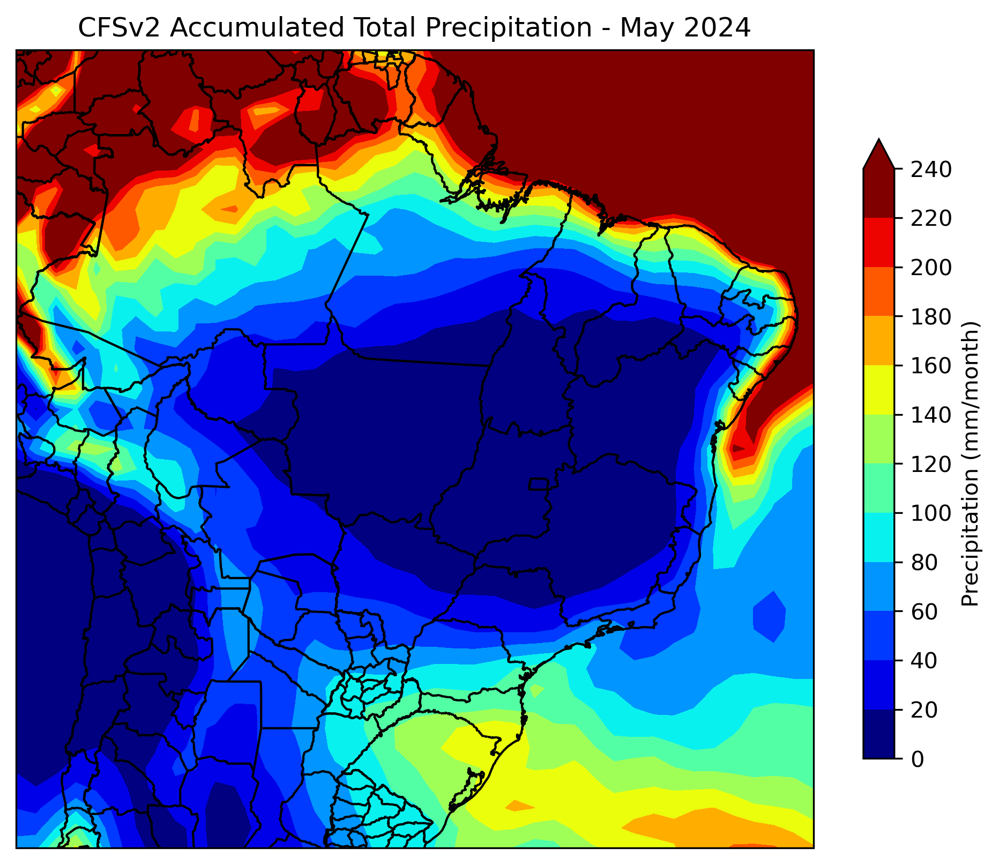

# NMME

Este repositório contém scripts e dados para a plotagem de dados brutos de precipitação e temperatura do produto NMME da NOAA. O NMME (North American Multi-Model Ensemble) é um projeto que fornece previsões climáticas usando uma combinação de múltiplos modelos climáticos.

## Descrição

O objetivo deste projeto é visualizar os dados brutos de precipitação e temperatura fornecidos pelo NMME da NOAA. Utilizamos diversas bibliotecas de plotagem em Python para criar mapas que ajudam a interpretar os dados climáticos.

## Estrutura do Repositório

- `Scripts/`: Contém scripts utilizados para processar e analisar os dados.
- `Dados/`: Contém os dados brutos e processados.
- `Figuras/`: Contém figuras geradas a partir dos dados.

## Pré-requisitos

Antes de executar os scripts, você precisará instalar as seguintes bibliotecas Python:

- numpy
- pandas
- matplotlib
- seaborn
- cartopy
- xarray
- netCDF4
  
## Imagens

### Figura 1: Exemplo de Previsão de Anomalia de Precipitação Mensal - ENSEMBLE


### Figura 2: Exemplo de Previsão de Anomalia de Temperatura Máxima Mensal - NMME



### Figura 3: Exemplo de Previsão de Precipitação Acumulada - CFSv2



## Como Utilizar

1. Clone este repositório:
    ```bash
    git clone https://github.com/valkiriaandrade/NMME.git
    ```

2. Navegue até o diretório do projeto:
    ```bash
    cd NMME
    ```

3. Execute os scripts conforme necessário.

## Contribuições

Contribuições são bem-vindas! Sinta-se à vontade para abrir issues e pull requests.

## Licença

Este projeto está licenciado sob a Licença MIT. Veja o arquivo [LICENSE](LICENSE) para mais detalhes.

